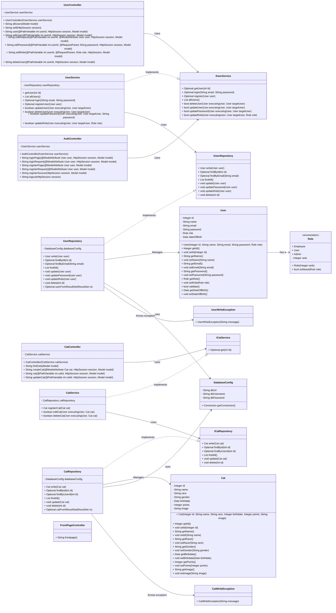

# Class diagram

```mermaid
classDiagram
direction LR
    class User{
        - Integer Id
        - String name
        - String email
        - String password
        - Role role
        - Date dateOfBirth
        
        + User(Integer Id, String name, String email, String password, Role role)
        
        + Integer getId()
        + void setId(Integer Id)
        + String getName()
        + void setName(String name)
        + String getEmail()
        + void setEmail(String email)
        + String getPassword()
        + void setPassword(String password)
        + Role getRole()
        + void setRole(Role role)
        + bool validate()
        + Date getDateOfBirth()
        + void setDateOfBirth()
    }
    
    class Role {
        <<enumeration>>
        + Employee
        + User
        + Admin
        - Integer rank
        + Role(Integer rank)
        + bool isAtleast(Role role)
                
    }
    
    class Cat {
        - Integer Id
        - String name
        - String race
        - String gender;
        - Date birthdate
        - Integer points
        - String image
        
        + Cat(Integer Id, String name, String race, Integer birthdate, Integer points, String image)
        
        + Integer getId()
        + void setId(Integer Id)
        + String getName()
        + void setId(String name)
        + String getRace()
        + void setRace(String race)
        + String getGender()
        + void setGender(String gender)
        + Date getBirthdate()
        + void setBirthdate(Date birthdate)
        + Integer getPoints()
        + void setPoints(Integer points)
        + String getImage()
        + void setImage(String image)
        }
        
    class UserService {
        - UserRepository userRepository
        + getUser(int id)
        + List<User> allUsers()
        + Optional<User> login(String email, String password)
        + Optional<User> registerUser(User user)
        + boolean updateUser(User executingUser, User targetUser)
        + boolean deleteUser(User executingUser, User targetUser)
        + boolean updatePassword(User executingUser, User targetUser, String password)
        + boolean updateRole(User executingUser, User targetUser, Role role)        
    }
    
    class IUserService {
        + Optional<User> getUser (int Id)
        + Optional<User> login(String email, String password)
        + Optional<User> register (User user)
        + List<User> allUsers()
        + bool deleteUser(User executingUser, User targetUser)
        + bool updateUser(Use executingUser, User targetUser)
        + bool updatePassword(User executingUser, User targetUser)
        + bool updateRole(User executingUser, User targetUser, Role role)
    }
    
    class UserRepository {
        - DatabaseConfig databaseConfig
        + User write(User user)
        + Optional<User> findById(int id)
        + Optional<User> findByEmail(String email)
        + List<User> findAll()
        + void update(User user)
        + void updatePassword(user user)
        + void updateRole(User user)
        + void delete(int id)
        + Optional<User> userFromResultSet(ResultSet rs)
    }
    
    class IUserRepository {
        + User write(User user)
        + Optional<User> findById(int id)
        + Optional<User> findByEmail(String email)
        + List<User> findAll()
        + void update(User user)
        + void updatePassword(User user)
        + void updateRole(User user)
        + void delete(int id)
    }
    
    class UserController {
        - UserService userService
        + UserController(IUserService userService)
        + String allUsers(Model model)
        + String self(HttpSession session)
        + String user(@PathVariable int userId, HttpSession session, Model model)
        + String editUser(@PathVariable int userId, HttpSession session, Model model)
        + String editRequest(@PathVariable int userId, @ModelAttribute User user, HttpSession session, Model model)
        + String editPassword(@PathVariable int userId, @RequestParam String password, HttpSession session, Model model)
        + String editRole(@PathVariable int userId, @RequestParam, Role role, HttpSession, Model model)
        + String deleteUser(@PathVariable int userId, HttpSession session, Model model)
    }
    
    class CatService {
        - CatRepository catRepository
        + Cat registerCat(Cat cat)
        + boolean editCat (User executingUser, Cat cat)
        + boolean deleteCat (User executingUser, Cat cat)
    }
    
    class ICatService {
        + Optional<Cat> get (int Id)
 }
    
    class CatRepository {
        - DatabaseConfig databaseConfig
        + Cat write(Cat cat)
        + Optional<Cat> findById(int id)
        + Optional<Cat> findByUserId(int id)
        + List<Cat> findAll()
        + void update(Cat cat)
        + void delete(int id)
        + Optional<Cat> catFromResultSet(ResultSet rs)
    }
    
    class ICatRepository {
        + Cat write(Cat cat)
        + Optional<Cat> findById(int id)
        + Optional<Cat> findByUserId(int id)
        + List<Cat> findAll()
        + void update(Cat cat)
        + void delete(int id)
    }
    
    class CatController {
        - CatService catService
        + CatController(ICatService catService)
        + String findCats(Model model)
        + String createCat(@ModelAttribute Cat cat, HttpSession session, Model model)
        + String cat(@PathVariable int catId, HttpSession session, Model model)
        + String updateCat(@PathVariable int catId, HttpSession session, Model model)
        
    }
    
    class AuthController {
        - IUserService userService
        + AuthController(IUserService userService)
        + String loginPage(@ModelAttribute User user, HttpSession session, Model model)
        + String loginRequest(@ModelAttribute User user, HttpSession session, Model model)
        + String registerPage(@ModelAttribute User user, Model model)
        + String registerRequest(@ModelAttribute User user, Model model)
        + String registerSucess(HttpSession session, Model model)
        + String logout(HttpSession session)
    }
    
    class FrontPageController {
        + String frontpage()
    }
    
    class UserWriteException {
        + UserWriteException(String message)
    }
    
    class CatWriteException {
        + CatWriteException(String message)
    }

    class DatabaseConfig {
        - String dbUrl
        - String dbUsername
        - String dbPassword
        + Connection getConnection()
    }
%% Interface implementations
    UserService ..|> IUserService : Implements
    UserRepository ..|> IUserRepository : Implements
    CatService ..|> ICatService : Implements
    CatRepository ..|> ICatRepository :Implements

%% Dependency injections
    UserController --> IUserService : Uses
    AuthController --> IUserService : Uses
    UserService --> IUserRepository : Uses
    UserRepository --> User : Manages
    CatController --> ICatService : Uses
    CatService --> ICatRepository : Uses
    CatRepository --> Cat : Manages
    UserRepository --> DatabaseConfig : uses
    CatRepository --> DatabaseConfig : uses
    
%% Relationships
    User --> Role : has a
    UserRepository -->UserWriteException : throws exception
    CatRepository -->CatWriteException : throws exception
```