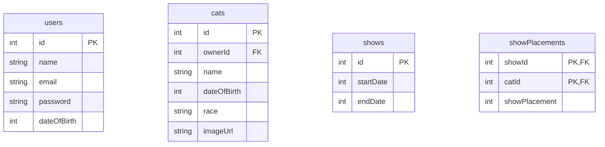

# ER-diagram

```mermaid
erDiagram
    users {
        int id PK
        string name
        string email
        string password
        int dateOfBirth
    }

    cats {
        int id PK
        int ownerId FK
        string name
        int dateOfBirth
        string race
        string imageUrl
    }

    shows {
        int id PK
        int startDate
        int endDate
    }

    showPlacements {
        int showId PK, FK
        int catId PK, FK
        int showPlacement
    }
```