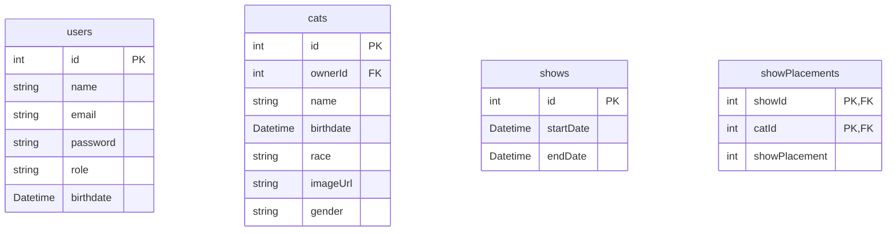

# ER-diagram

```mermaid
erDiagram
    users {
        int id PK
        string name
        string email
        string password
        string role
        Datetime birthdate
    }

    cats {
        int id PK
        int ownerId FK
        string name
        Datetime birthdate
        string race
        string imageUrl
        string gender
    }
    
    shows {
        int id PK
        Datetime startDate
        Datetime endDate
    }

    showPlacements {
        int showId PK, FK
        int catId PK, FK
        int showPlacement
    }
```