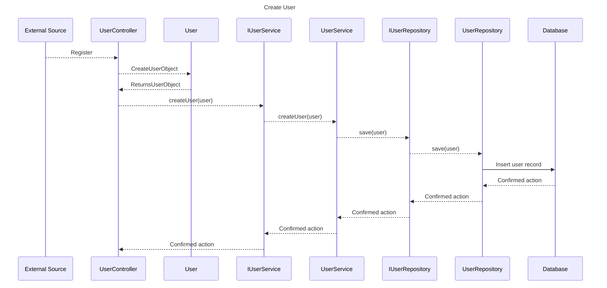
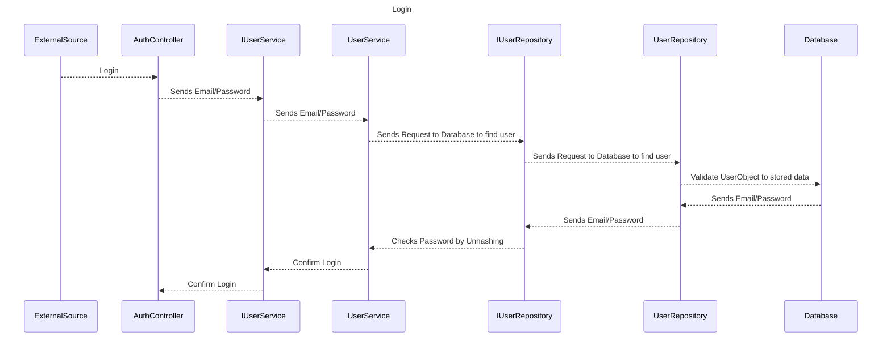

SequenceDiagram Create User

```mermaid
sequenceDiagram
    title Create User
    participant External Source
    participant UserController
    participant User
    participant IUserService
    participant Service as UserService
    participant IUserRepository
    participant Repo as UserRepository
    participant DB as Database
    
    
    
    
    External Source -->>UserController: Register
    UserController -->>User: CreateUserObject
    User-->>UserController: ReturnsUserObject
    UserController-->>IUserService: createUser(user)
    IUserService-->>Service: createUser(user)
    Service-->>IUserRepository: save(user)
    IUserRepository-->>Repo: save(user)
    Repo->>DB: Insert user record
    DB-->>Repo: Confirmed action
    Repo-->>IUserRepository: Confirmed action
    IUserRepository-->>Service: Confirmed action
    Service-->>IUserService: Confirmed action
    IUserService-->>UserController: Confirmed action
   
```

```mermaid
sequenceDiagram
    title Login
    
    participant external as ExternalSource
    participant Controller as AuthController
    participant IService as IUserService
    participant Service as UserService
    participant IRepo as IUserRepository
    participant Repo as UserRepository
    participant DB as Database
    
    external -->>Controller: Login
    Controller -->> IService: Sends Email/Password
    IService -->>Service: Sends Email/Password
    Service-->>IRepo: Sends Request to Database to find user
    IRepo-->>Repo: Sends Request to Database to find user
    Repo -->>DB: Validate UserObject to stored data
    DB -->> Repo: Sends Email/Password
    Repo -->> IRepo: Sends Email/Password
    IRepo -->> Service: Checks Password by Unhashing
    Service -->> IService: Confirm Login
    IService -->> Controller: Confirm Login
    
```