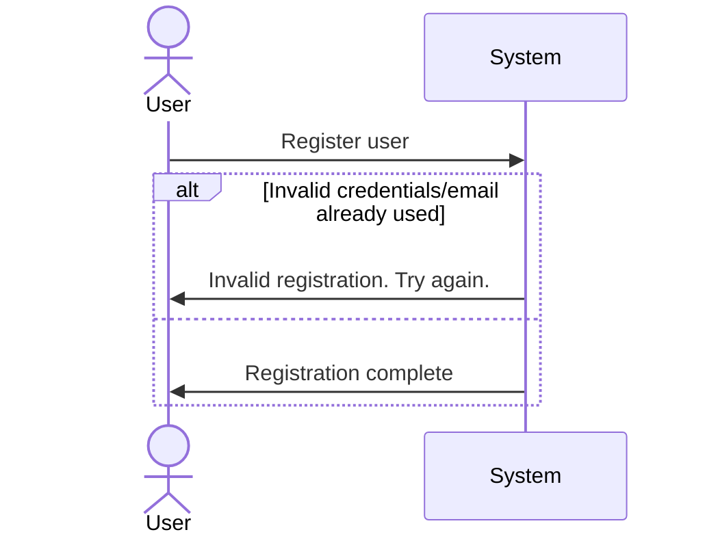
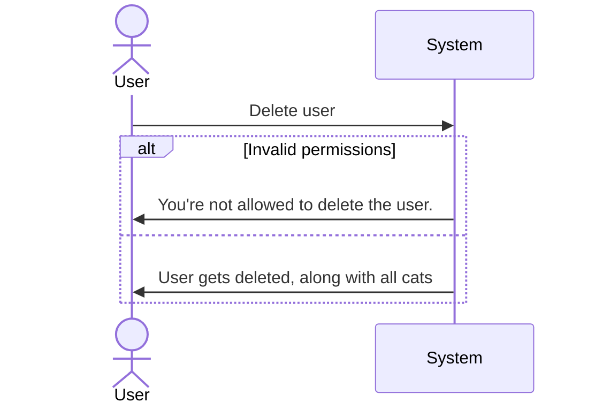
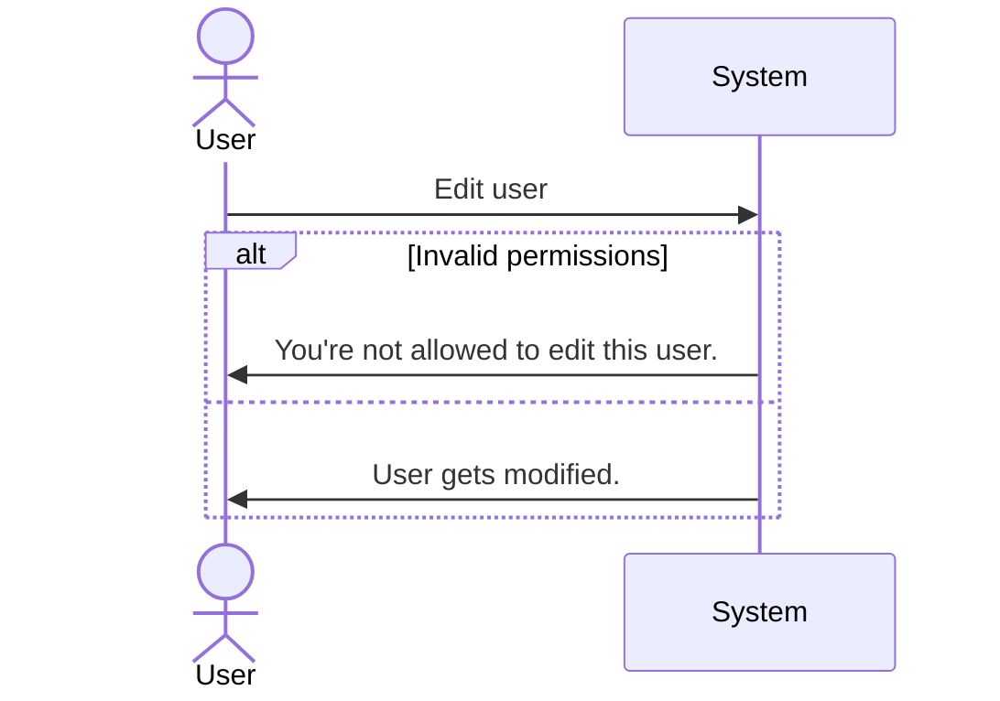
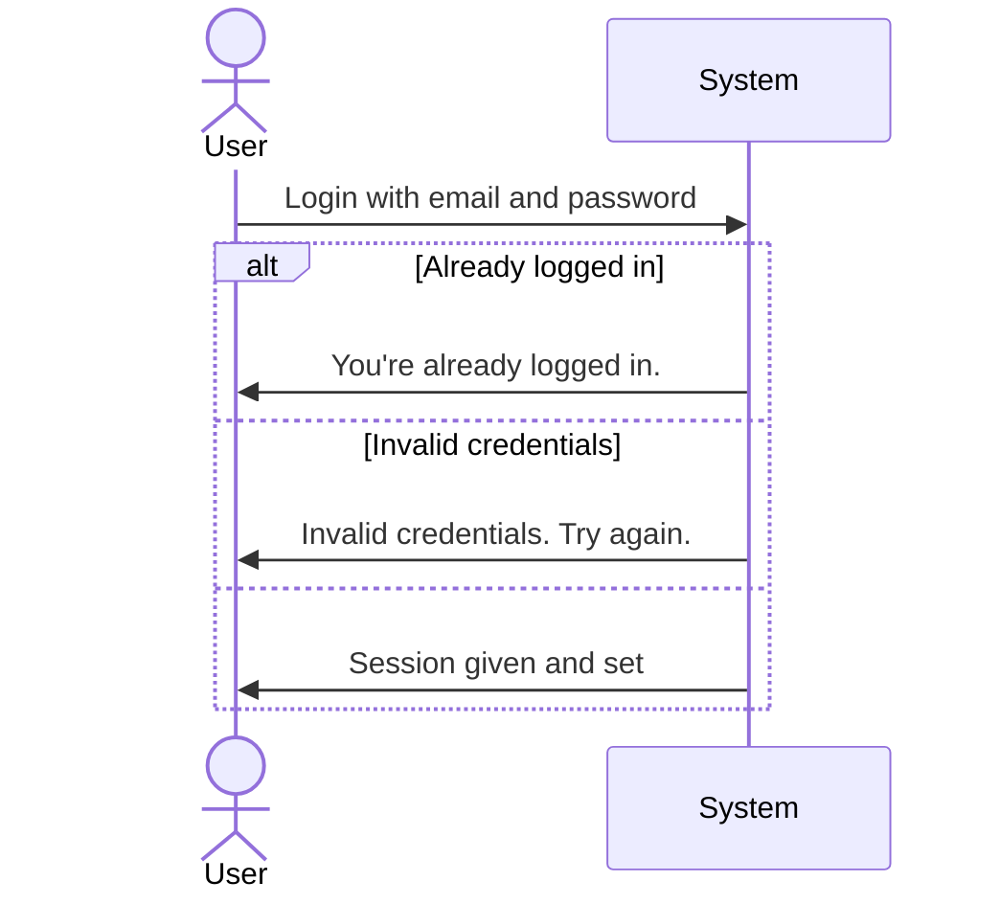
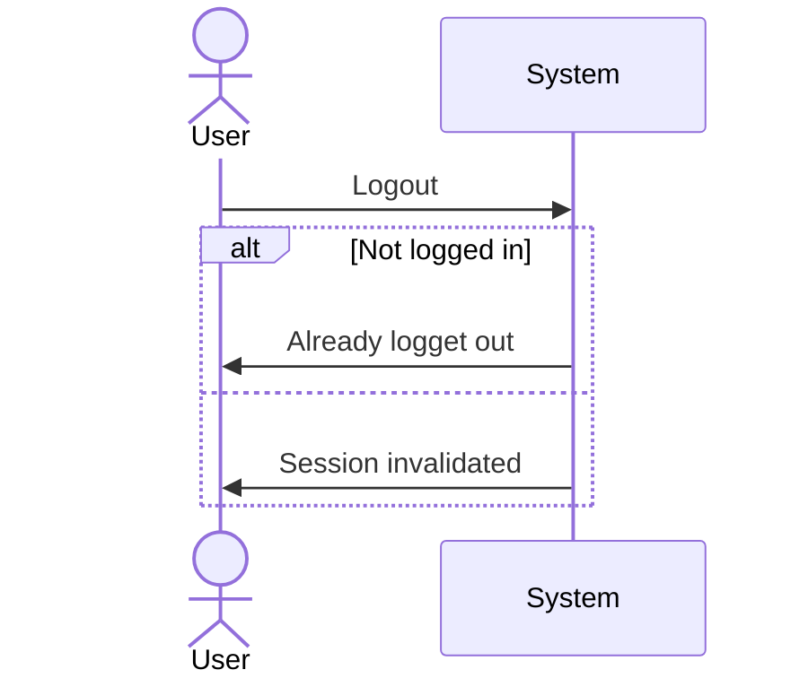
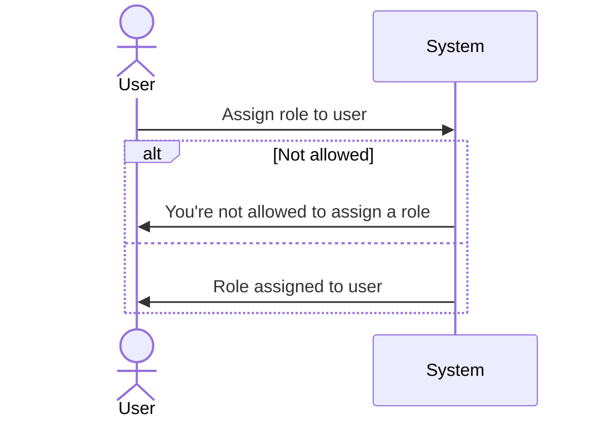

# Systemsequencediagrams

## Create user ([#1](https://github.com/zealand-cs/Racekatteklubben/issues/1))

## Delete user ([#2](https://github.com/zealand-cs/Racekatteklubben/issues/2))

## Edit user ([#3](https://github.com/zealand-cs/Racekatteklubben/issues/3))

## Login ([#4](https://github.com/zealand-cs/Racekatteklubben/issues/4))

## Logout ([#5](https://github.com/zealand-cs/Racekatteklubben/issues/5))

## Role assignment ([#6](https://github.com/zealand-cs/Racekatteklubben/issues/6))

