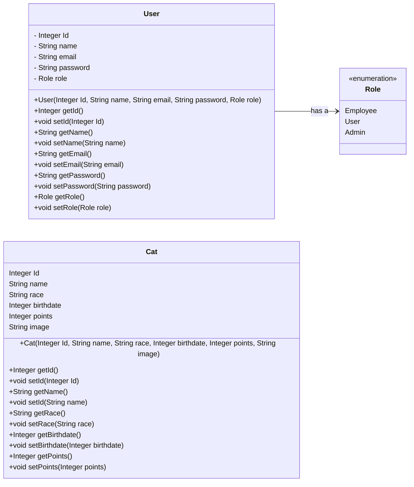

# Class diagram model

```mermaid
classDiagram
direction LR
    class User{
        - Integer Id
        - String name
        - String email
        - String password
        - Role role
        
        +User(Integer Id, String name, String email, String password, Role role)
        
        +Integer getId()
        +void setId(Integer Id)
        +String getName()
        +void setName(String name)
        +String getEmail()
        +void setEmail(String email)
        +String getPassword()
        +void setPassword(String password)
        +Role getRole()
        +void setRole(Role role)
    }
    
    class Role {
        <<enumeration>>
        Employee
        User
        Admin
        
    }
    
    class Cat {
        Integer Id
        String name
        String race
        Integer birthdate
        Integer points
        String image
        
        +Cat(Integer Id, String name, String race, Integer birthdate, Integer points, String image)
        
        +Integer getId()
        +void setId(Integer Id)
        +String getName()
        +void setId(String name)
        +String getRace()
        +void setRace(String race)
        +Integer getBirthdate()
        +void setBirthdate(Integer birthdate)
        +Integer getPoints()
        +void setPoints(Integer points)
        
        
    }
    
    
    
     
User --> Role : has a
```