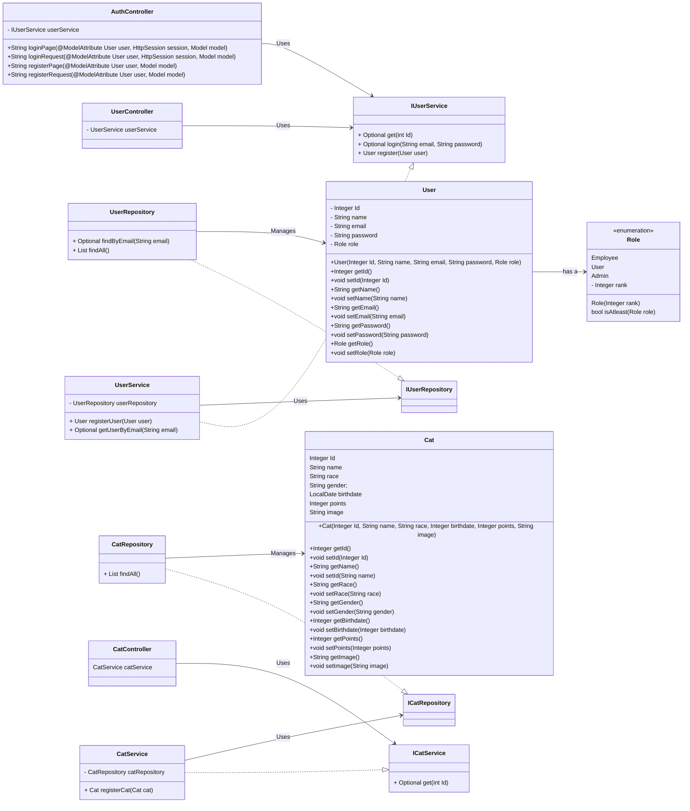

# Class diagram

```mermaid
classDiagram
direction LR
    class User{
        - Integer Id
        - String name
        - String email
        - String password
        - Role role
        
        +User(Integer Id, String name, String email, String password, Role role)
        
        +Integer getId()
        +void setId(Integer Id)
        +String getName()
        +void setName(String name)
        +String getEmail()
        +void setEmail(String email)
        +String getPassword()
        +void setPassword(String password)
        +Role getRole()
        +void setRole(Role role)
    }
    
    class Role {
        <<enumeration>>
        Employee
        User
        Admin
        - Integer rank
        Role(Integer rank)
        bool isAtleast(Role role)
                
    }
    
    class Cat {
        Integer Id
        String name
        String race
        String gender;
        LocalDate birthdate
        Integer points
        String image
        
        +Cat(Integer Id, String name, String race, Integer birthdate, Integer points, String image)
        
        +Integer getId()
        +void setId(Integer Id)
        +String getName()
        +void setId(String name)
        +String getRace()
        +void setRace(String race)
        +String getGender()
        +void setGender(String gender)
        +Integer getBirthdate()
        +void setBirthdate(Integer birthdate)
        +Integer getPoints()
        +void setPoints(Integer points)
        +String getImage()
        +void setImage(String image)
        
        }
        
    class UserService {
        - UserRepository userRepository
        + User registerUser(User user)
        + Optional<User> getUserByEmail(String email) 
    }
    
    class IUserService {
        + Optional<User> get (int Id)
        + Optional<User> login(String email, String password)
        + User register (User user)
    }
    
    class UserRepository {
        + Optional<User> findByEmail(String email)
        + List<User> findAll()
    }
    
    class IUserRepository {
        
    }
    
    class UserController {
        - UserService userService

    }
    
    class CatService {
        - CatRepository catRepository
        + Cat registerCat(Cat cat)
    }
    
    class ICatService {
        + Optional<Cat> get (int Id)
 }
    
    class CatRepository {
        + List<Cat> findAll()
    }
    
    class ICatRepository {
        
    }
    
    class CatController {
        CatService catService
    }
    
    class AuthController {
        - IUserService userService
        +String loginPage(@ModelAttribute User user, HttpSession session, Model model)
        +String loginRequest(@ModelAttribute User user, HttpSession session, Model model)
        +String registerPage(@ModelAttribute User user, Model model)
        +String registerRequest(@ModelAttribute User user, Model model)
    }


%% Interface implementations
    UserService ..|> IUserService
    UserRepository ..|> IUserRepository
    CatService ..|> ICatService
    CatRepository ..|> ICatRepository

%% Dependency injections
    UserController --> IUserService : Uses
    AuthController --> IUserService : Uses
    UserService --> IUserRepository : Uses
    UserRepository --> User : Manages
    CatController --> ICatService : Uses
    CatService --> ICatRepository : Uses
    CatRepository --> Cat : Manages

%% User and Role Relationship
    User --> Role : has a
    
```